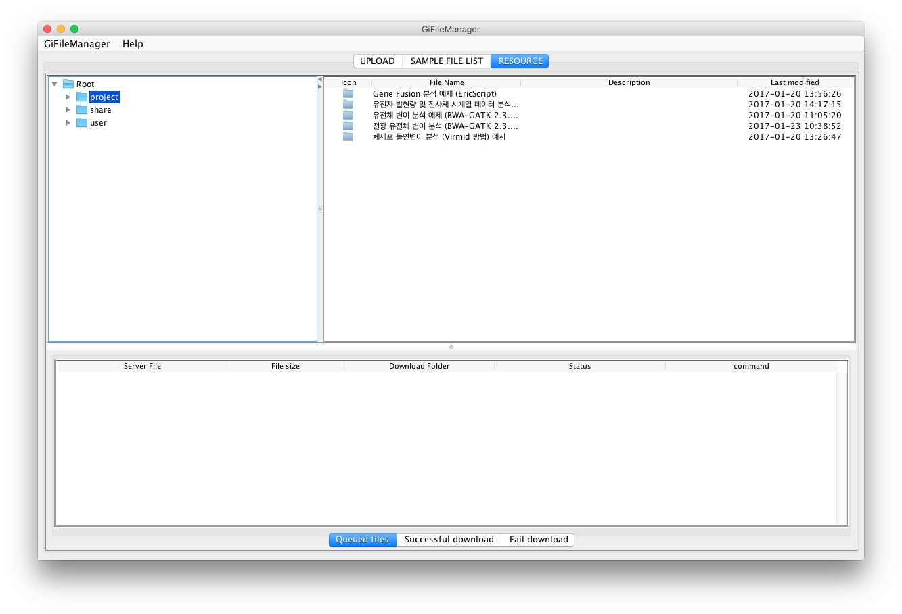
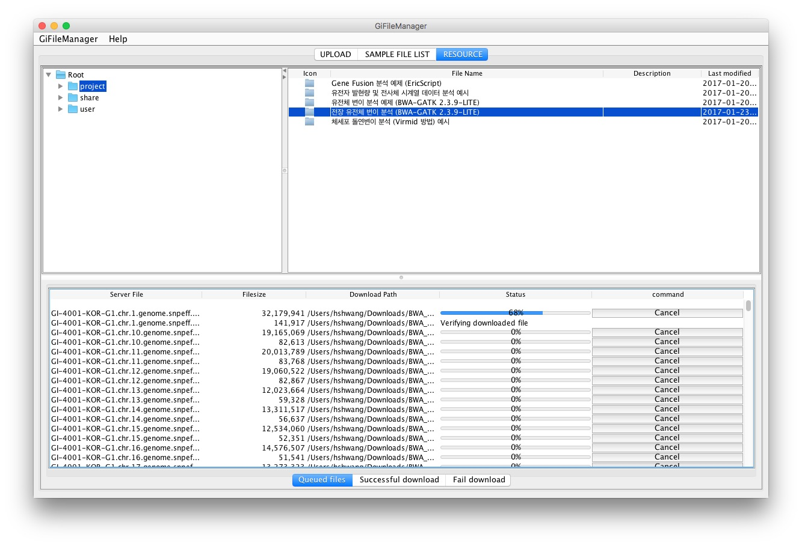
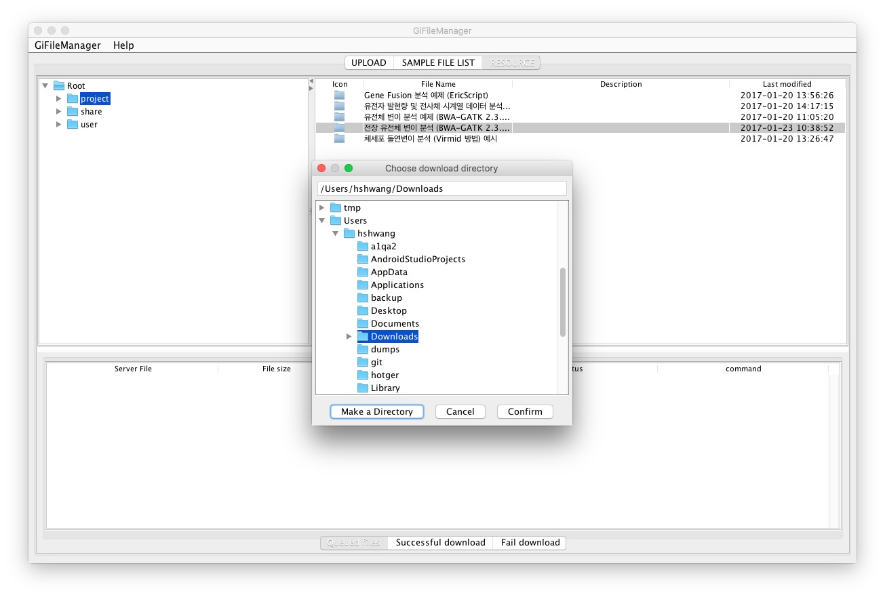
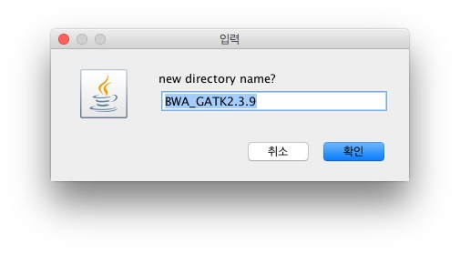

# Resource Download

## 기능

  - Gisys에서 관리하는 Project와 Sample 리소스를 다운로드 하는 페이지입니다.

## 화면 구성

* 왼쪽 트리: Project와 Sample 리소스를 보여줍니다
* 오른쪽 테이블: 선택한 디렉토리의 하위 폴더 및 파일 목록입니다.
    * Icon : 폴더 또는 파일를 구분하는 아이콘을 보여줍니다.
    * File Name : 파일명입니다.
    * Description : 리소스에 대한 설명입니다.
    * Last Modified : 폴더 또는 파일의 마지막 수정 일자입니다.

* 아래 테이블:
    * **Queued File**: 다운로드 할 파일들이 대기하는 탭입니다.
        * Server File : 파일명입니다.
        * File size : 파일의 크기입니다.
        * Download Folder : 다운로드 파일을 저장하는 위치입니다.
        * Status : 다운로드진행 상태입니다. 별첨 1) 참조
        * command : 작업 취소 버튼입니다. 다운로드가 완료되기전까지 작업 취소가 가능합니다.

    * **Successful Download**: 다운로드 파일중 성공한 파일들이 모이는 곳입니다
        * File name : 파일명입니다.
        * File size : 파일의 크기입니다.
        * Download Folder : 파일을 저장하는 위치입니다.
        * File path : 파일의 서버 경로입니다.

    * **Fail Download**: 파일을 업로드후 오류가 발생한 파일들이 모이는 곳입니다.
        * File name : 파일명입니다.
        * File size : 파일의 크기입니다.
        * Download Folder : 파일을 저장하는 위치입니다.
        * Status :  실패 사유입니다.
        * File path : 파일의 서버 경로입니다.

## Resource Download 방법

* GiFileManager를 실행합니다.
* 로그인을 합니다.
* 중앙 상단 탭메뉴에서 **RESOURCE**를 선택합니다
* 왼쪽 트리에서 다운로드할 항목을 선택합니다.
* 오른쪽 테이블에서 다운로드할 폴더가 있는 행을 선택합니다. 여러개의 행을 선택할 수 있습니다.
* 선택한 행을 아래 테이블로 드래그앤드랍을 합니다. **Queued files**탭이 선택되어 있어야 합니다.
* 다운로드 디렉토리를 선택합니다. **Choose download directory창**이 보여집니다.

   

### 다운로드 디렉토리 새로 만들기
* **Choose download directory창**에서 디렉토리를 선택합니다.

* **Make a Directory** 버튼을 클릭합니다

* **디렉토리명 입력 창**이 나타납니다.
   - 생성할 디렉토리명을 입력합니다.

 

* 확인 버튼을 클릭합니다.

## 별첨1-파일 다운로드 상태

* progress bar : 파일을 다운로드 진행 상태와 진행율을 보여줍니다.
* Completed : 파일 다운로드가 정상적으로 완료된 상태입니다.
* Canceled : 파일 다운로드를 사용자가 취소한 상태입니다.
* File download fail : 네트워크나 서버 등의  이유로 파일 다운로드를 실패한 상태입니다.
* Verifying downloaded file : 다운로드 파일의 정상 유무를 확인하는 상태입니다. 상당한 시간이 소요됩니다.
