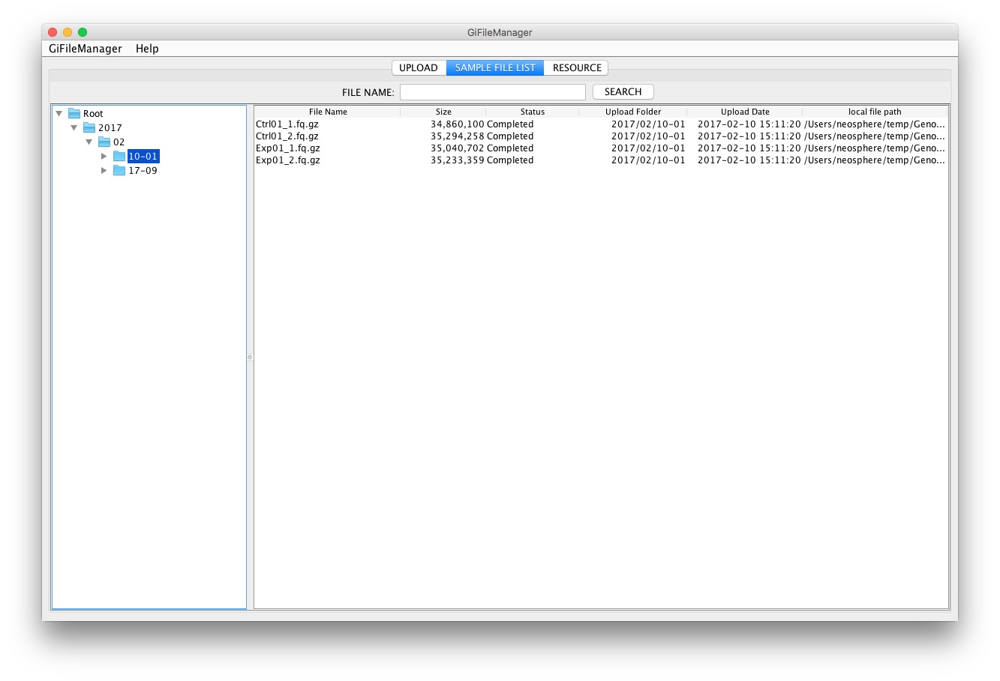

# Sample File List

## 기능

  - 업로드한 샘플 파일들을 조회하는 화면입니다.

## 화면 구성

* 왼쪽 트리 : 사용자가 업로드 샘플의 업로드 폴더를 보여줍니다.
    - 접근성을 높이기 위해 년/월/일-차수 트리구조로 보여줍니다.

* 오른쪽 테이블: 선택한 디렉토리의 파일들을 목록 형식으로 보여 줍니다.
    * File Name : 파일명입니다.
    * Size :  파일의 크기입니다.
    * Status : 업로드한 파일의 상태입니다.
    * Upload Date : 샘플 파일을 업로드 한 날짜와 시간입니다.
    * Local file path : 업로드 한 파일의 원래 위치입니다.

## 사용법

### 트리를 통한 검색

 * 왼쪽 트리에서 노드를 선택하면 하위 노드의 샘플 파일까지 포함해서 조회를 합니다
 * 예) 2017년을 선택하면 2017년에 업로드한 모든 샘플 파일들을 보여줍니다.

### SEARCH 통한 검색

 1. "File Name"에 검색할 파일명을 입력합니다.
 2. "SEARCH"버튼을 클릭합니다.
 3. 입력한 내용이 포함된 모든 샘플 파일들이 조회가 됩니다.