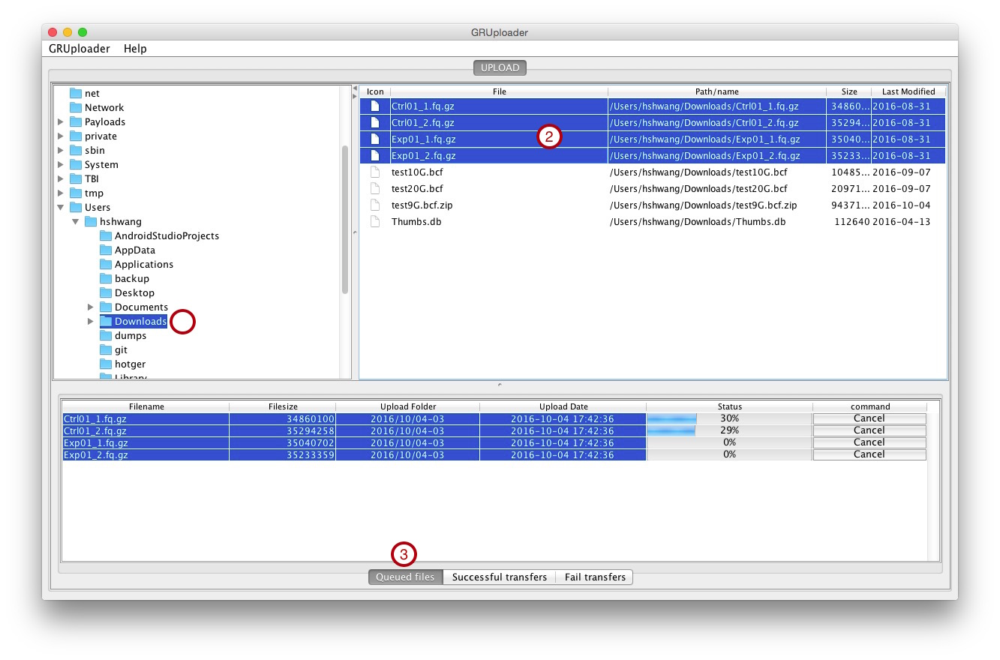
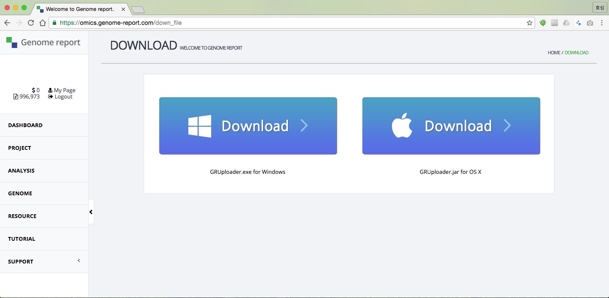

# GRUploader

## 선행작업

  - 회원가입
     - 사이트 주소는 [https://omics.genome-report.com/member](https://omics.genome-report.com/member)
  - GRUploader 다운로드
     - 다운로드 경로는 [http://www.genome-report.com/download](http://www.genome-report.com/download)
     - 자신의 OS 버전에 맞게 다운로드 합니다. 왼쪽 DOWNLOAD 버튼은 윈도우용, 오른쪽 DOWNLOAD 버튼은 OS X 용입니다.
  - JDK7.0+  설치
     - 미설치 시 설치하라는 알람창이 열립니다.
     
## 화면 구성

* 상단 왼쪽: 사용자 PC의 폴더 정보입니다.
* 상단 오른쪽: 선택한 디렉토리의 하위 폴더 및 파일 목록입니다.
    * Icon : 폴더 여부입니다.
    * File : 파일명입니다.
    * Path_name : 파일의 전체 경로입니다
    * Size : 디렉토리 또는 파일의 크기입니다.
    * Last Modified : 폴더 또는 파일의 마지막 수정 일자입니다.
* 하단:
    * **Queued File**: 파일을 업로드 하는 탭
        * Filename : 업로드한 파일명입니다.
        * Filesize : 업로드한 파일의 크기입니다.
        * Upload Folder : 업로드한 파일의 저장 위치 입니다. 형식은 yyyy/MM/dd-당일로그인횟수 입니다.
        * Upload Data : 업로드 요청한 시간
        * Status : 업로드 진행 상태입니다., 별첨 1) 참조
        * command : 업로드가 완료되기 전에 취소할 수 있는 버튼입니다.
    * **Successful transfers**: 파일을 업로드후 성공한 파일들이 모이는 곳
        * Filename : 업로드한 파일명입니다.
        * Filesize : 업로드한 파일의 크기입니다.
        * Upload Folder : 업로드한 파일의 저장 위치 입니다. 형식은 yyyy/MM/dd-당일로그인횟수 입니다.
        * Upload Data : 업로드 요청한 시간
    * **Fail transfers**: 파일을 업로드후 오류가 발생한 파일들이 모이는 곳
        * Filename : 업로드한 파일명입니다.
        * Filesize : 업로드한 파일의 크기입니다.
        * Upload Folder : 업로드한 파일의 저장 위치 입니다. 형식은 yyyy/MM/dd-당일로그인횟수 입니다.
        * Upload Data : 업로드 한 시간
        * Status : 업로드 실패 사유

   

## File Upload  방법 

* GRUploader를 실행합니다.
* 로그인 을 합니다.
* 로그인 창이 보이지 않으면  상단 메뉴바의 GRUploader > Login  메뉴를 선택합니다.
* 왼쪽 상단 상자에서 업로드할 파일이 있는 폴더를 선택합니다.
* 왼쪽 하단 상자에서 업로드할 파일을 선택합니다. 여러개의 파일을 선택할 수 있습니다.
* 선택한 파일들을 하단으로 드래그앤드랍을 합니다. **Queued files**탭이 선택되어 있어야 합니다.

## GRUploader 업그레이드 방법 

* 로그인시 업그레이드가 있는 경우  업그레이드 안내 팝업창이 나타납니다.
*  Help > Download page 메뉴를 통해서 최신 버전으로 업그레이드 할 수 있습니다.
* 업그레이드는 프로그램 성능향상을 위해 수시로 진행됩니다.
* 왼쪽 Download 버튼은 윈도우용, 오른쪽 Download 버튼은 OS X 용입니다.

#### GRUploader 버전 확인

* Help > About 메뉴에 현재 버전이 있습니다.

## GRUploader 주요 기능

* Drag&Drop으로 파일 업로드
* 업로드 작업 취소
    * 파일 업로드 도중에 취소를 할 수 있습니다.
    * 취소 하고 싶은 파일 있는 행에서 Cancel버튼을 클릭합니다.
* 업그레이드 알람
    * 로그인시 새로운 버전이 있는 경우 팝업창이  나타납니다.
* GRUploader 다운로드 페이지 제공
* 자동 재 업로드 기능
    * 업로드가 실패한 경우에 다시 로그인을 하는 경우 자동으로 업로드 작업이 진행됩니다.
    * 사용자가 취소한 작업은 자동으로 다시 업로드 되지 않습니다. 
* 진행 상태바
    * 업로드 파일의 진행 상황을 알 수 있는 상태바입니다. 진척율을 보여줍니다.
* Queued files
    *  업로드할 파일을 두는 곳입니다.
* Successful transfers
    *  업로드가 정상적으로 완료된 파일을 보여줍니다.
* Fail transfers
    *  업로드 중 오류가 발생한 파일들을 보여줍니다.
    *  **Status**를 통해 오류 원인을 알 수 있습니다.

## 별첨1-파일 업로드 상태

* progress bar : 파일을 진행 상태와 진행율을 보여줍니다.
* Completed : 파일 업로드가 정상적으로 완료된 상태입니다.
* Canceled : 파일 업로드를 사용자가 취소한 상태입니다.
* File upload fail : 알 수 없는 이유로 파일 업로드를 실패한 상태입니다., 해당 파일을 다시 업로드 할 수 있습니다.
* File duplication error : 같은 upload folder에 같은 파일이 업로드 된 상태입니다.
* File not exists : 사용자  PC에 파일이 존재하지 않는 상태 입니다.
* Database inserting : 업로드 파일정보를 데이타베이스 서버에 저장하는 상태입니다.

## 업로드 가능한 파일 유형

  - zip
  - gz
  - bz
  - bz2
  - fasta,fa
  - gtf
  - gff,gff3
  - bed
  - fastq,fq
  - xls
  - vcf,bcf,gvcf
  - xlsx
  - bam,sam
  - cram
  - diff
  - fpkm_tracking

