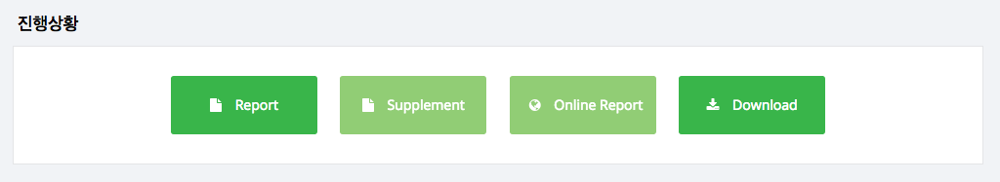
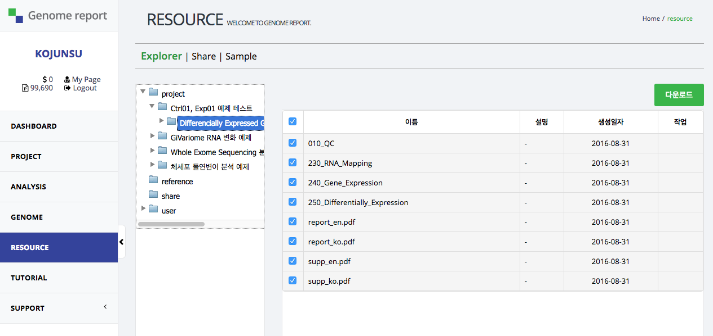
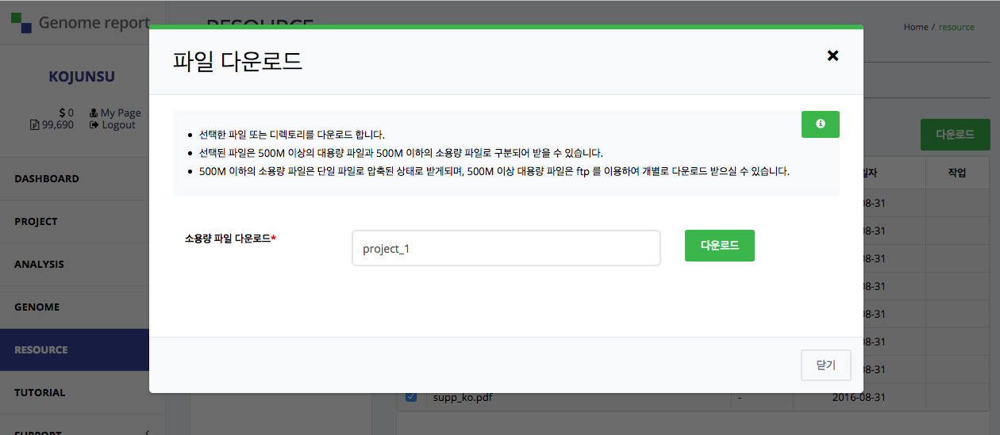

# Download

분석 결과 파일을 받는 방법을 설명합니다.

## Step 1. 프로젝트 다운로드 화면으로 이동

프로젝트 상세보기 화면에서 <kbd>Download</kbd>를 선택해서 RESOURCE의 프로젝트 다운로드 경로로
이동합니다.

## Step 2. 파일 선택 및 다운로드

RESOURCE 화면의 해당 프로젝트 화면입니다. 화면의 오른쪽 상자에 보이는 것이 해당 프로젝트의
결과 파일입니다. 다운로드 받기 원하는 파일을 선택합니다. 여기서는 모든 파일을 선택했습니다.

파일 선택 후 화면 오른족 위쪽의  <kbd>다운로드</kbd>를 선택하면, 아래와 같은 화면이 나타납니다.
**소용량 파일 다운로드** 항목에 저장할 파일명을 입력 후 <kbd>다운로드</kbd>를 선택하면,
파일 다운로드가 진행됩니다.

