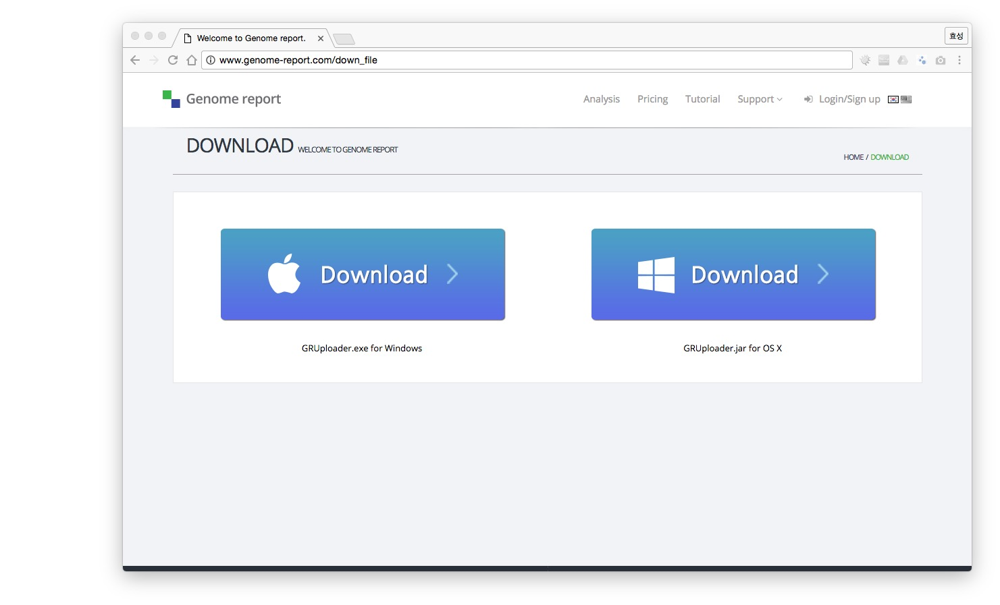
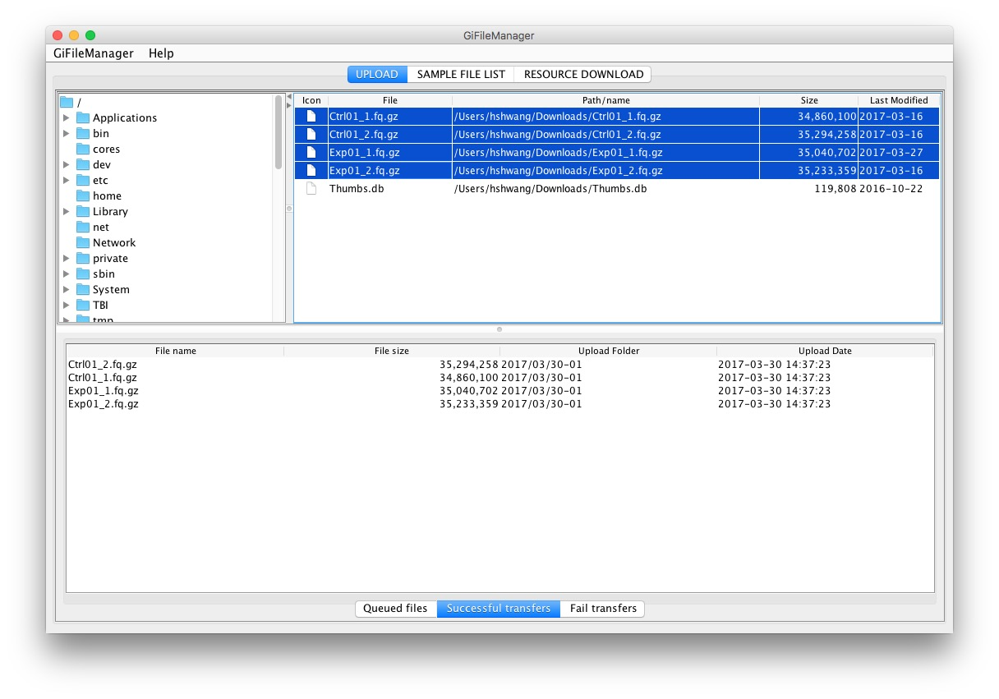

# 파일 업로드

Genome report를 이용한 NGS데이터 분석을 위해서 해야 할 첫 번째 작업은 파일 업로드 입니다.

Genome report는 파일 업로드를 위해서
**GiFileManager를 이용한 파일 업로드**와 **웹을 이용한 파일 업로드**를 지원하고 있으며, 500M 이상의 대용량 파일은 GiFileManager를 이용하셔야만
업로드 하실 수 있습니다. 이 예제에서는 GiFileManager를 이용해서 파일 업로드하는 것을 실습하겠습니다.

## Step 1. GiFileManager 받기

GiFileManager는 Genome report에서 사용하는 전용 파일 업로드 프로그램 입니다. 로그인 후  **SUPPORT >> Download** 메뉴를 선택하거나 다음 주소를 이용하여 바로 접근할 수 있습니다.

* <a href="http://www.genome-report.com/down_file" target="_blank">http://www.genome-report.com/down_file</a>

다운로드 페이지에는 각 운영체제에 해당하는 다운로드 프로그램을 받을 수 있는 링크가 준비되어 있습니다.
각 운영체제에 해당하는 실행파일을 다운로드 받습니다. (윈도우는 왼쪽, OSX와 리눅스는 오른쪽을 선택하시면 됩니다.)

## Step 2. 실행 및 로그인

다운로드 받은 GiFileManager를 실행합니다. 만약 윈도우에서 다운로드 받은 파일 실행 시에 "Windows의 PC보호"화면이 나올 경우 화면안의 **"추가 정보"**를 선택하시면, 설치를 계속 진행하실 수 있습니다.

로그인 창이 나타나면, Genome report 가입 ID와 암호를 입력하고 로그인 합니다.

!!!tip "Tip"
    "로그인 창"을 닫은 경우, **GiFileManager >> 로그인** 메뉴를 클릭합니다.

## Step 3. 파일을 업로드

다운 받은 파일을 업로드 할 차례입니다. GiFileManager는 3개의 탭메뉴로 구성되어 있습니다. 
**UPLOAD**탭 메뉴가 파일 업로드 화면입니다 이 화면은 3개의 화면으로 구성되어 있습니다. 상단 왼쪽의 디렉토리 선택 창, 상단 오른쪽의 파일 창, 하단이 파일 업로드 창입니다.
다음 순서를 따라서 파일을 업로드 합니다.

1. 상단 왼쪽에서 다운로드 받은 폴더로 이동합니다.
1. 상단 오른쪽에서 아래 4개의 파일을 선택하고 하단으로 **드래그앤드랍**을 합니다.  드래그앤드랍전에 **Queued files**탭이 선택되어 있어야 합니다.
    - Ctrl01_1.fq.gz
    - Ctrl01_2.fq.gz
    - Exp01_1.fq.gz
    - Exp01_2.fq.gz
1. 4개 파일이 **Successful transfers**탭에 등록될 때까지 윗 단계를 반복합니다.

!!!tip "Tip"
    여러개의 파일을 한번에 선택해서 드래그앤 드랍도 가능합니다. 
    4개 파일이 모두 정상적으로 업로드 되어야 만 샘플 등록을 진행할 수 있습니다.

!!!note "Note"
    **Queued files**탭에만 업로드 파일을 드랍할 수 있습니다.파일 드랍이 안되는 경우 탭메뉴를 먼저 확인하세요. 
    파일이 정상적으로 업로드 되면 **Successful transfers**탭에 등록됩니다. 
    파일 업로드가 실패하면 **Fail transfers**탭에 등록됩니다.**Status** 컬럼에서 오류 원인을 확인할 수 있습니다. 
    **Fail transfers**탭에 업로드한 파일의 상태값이 'File Upload Fail'인 경우 해당 파일을 업로드 작업을 다시 하면 됩니다. 
    파일 전송이 끝나기 전에 **GiFileManager**를 종료하면 전송 작업이 중단됩니다.

