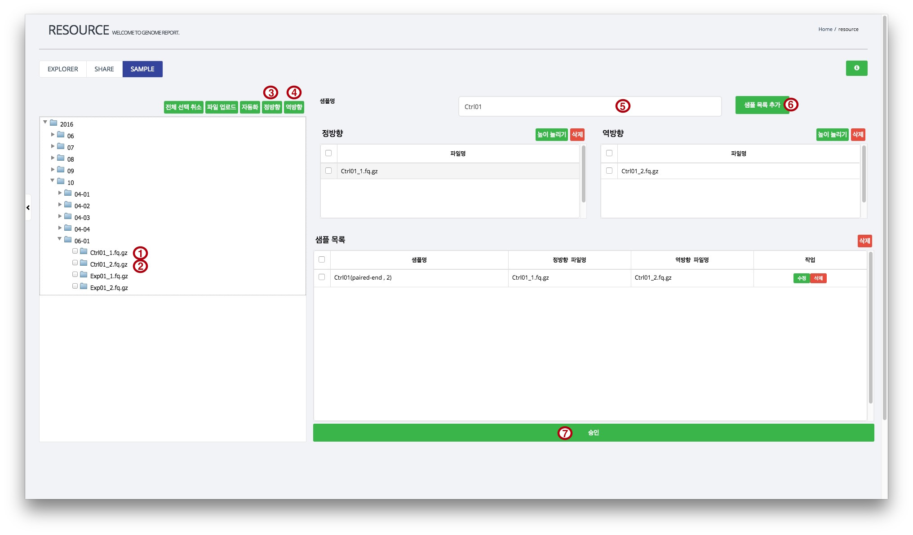
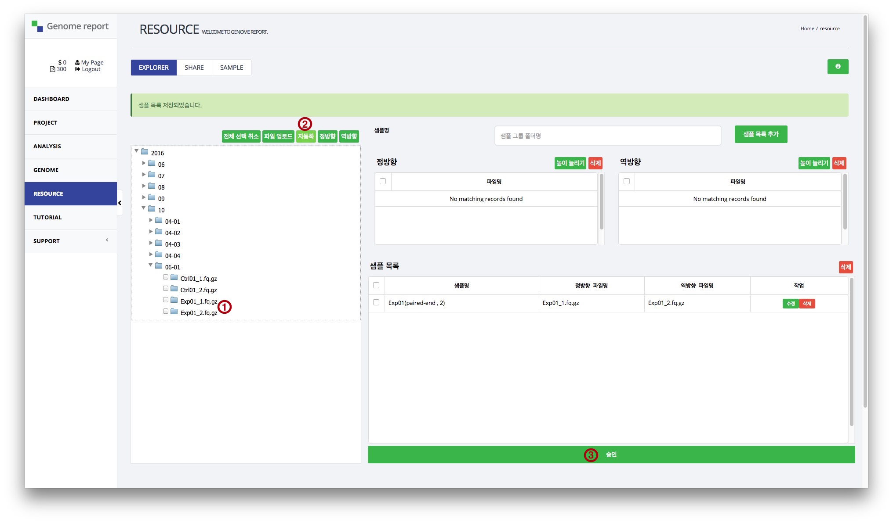
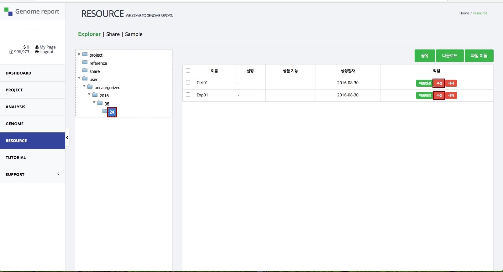

# 샘플 등록

샘플 생성은 업로드한 파일을 이용하여 분석의 단위가 되는 샘플을 등록하는 과정입니다. 

샘플 등록은 **파일을 직접 지정하는 방법**과 **자동화를 통한 파일 등록 방법**이 있습니다. 2개의 샘플을 각 각의 방법으로 등록해보겠습니다.

## Step 1. 사이트 로그인 및 메뉴 선택

1. <a href="https://omics.genome-report.com/member" target="_blank">Genome report</a> 사이트 로그인 후, 왼쪽 매뉴에서 <a href="https://omics.genome-report.com/resource" target="_blank">RESOURCE</a>를 클릭합니다.
2. Resource 페이지에서 "Sample" 메뉴를 클릭합니다.

!!!note "Note"
    GRUploader 프로그램에서 등록한 해독 파일은 다음 경로에 있습니다.  YYYY &#9654; MM &#9654; dd-로그인차수 (예:2016 &#9654; 08 &#9654; 24-01)

## Step 2. 파일 지정 방법을 이용한 Ctrl01 샘플 등록 

1. **2016 &#9654; 09 &#9654; 01-01** 폴더에서 `Ctrl01_1.fq.gz` 파일을 선택(check) 합니다.
1. 선택창 위쪽에 있는 <kbd>정방향</kbd>을 클릭합니다.
1. **2016 &#9654; 09 &#9654; 01-01** 폴더에서 `Ctrl01_2.fq.gz` 파일을 선택(check) 합니다.
1. 선택 창 위쪽에 있는 <kbd>역방향</kbd>를 클릭합니다.
1. 샘플명을  `Ctrl01`로 입력합니다.
1. <kbd>샘플 목록 추가</kbd> 버튼을 클릭합니다.
1. 샘플 목록 맨 아래에 있는 <kbd>승인</kbd> 버튼을 클릭합니다.

!!!tip "Tip"
        샘플명은 파일명을 이용하여 프로그램에서 부여하며, 사용자가 원하는 이름으로 변경할 수 있습니다.

## Step 3. 자동화를 통한 Exp01 샘플 등록

1. **2016 &#9654; 09 &#9654; 01-01** 폴더에서 `Exp01_1.fq.gz`, `Exp01_2.fq.gz` 파일을 동시에 체크합니다.
1. 선택창 위쪽에 있는 <kbd>자동화</kbd>를 클릭합니다..
1. 샘플 목록에 새로운 샘플이 등록된 것을 확인한 후 샘플 목록 맨 아래에 있는 <kbd>승인</kbd>을 클릭합니다.

!!!tip "Tip"
    자동화 이용시 "샘플명은 필수 입력입니다" 라는 메세지가 나오면 사용자가 직접 "샘플명"을 입력하면 됩니다.

## Step 4. 샘플 등록 확인

1. **Explorer|Share|Sample** 메뉴 중에서 **Explorer**를 클릭합니다.
1. 왼쪽 상자 안에서 **user &#9654; uncategorized &#9654; 2016 &#9654; 09 &#9654; 01** 선택합니다. 
1. 등록된 2개의 샘플이 나타나는 것을 확인합니다.

